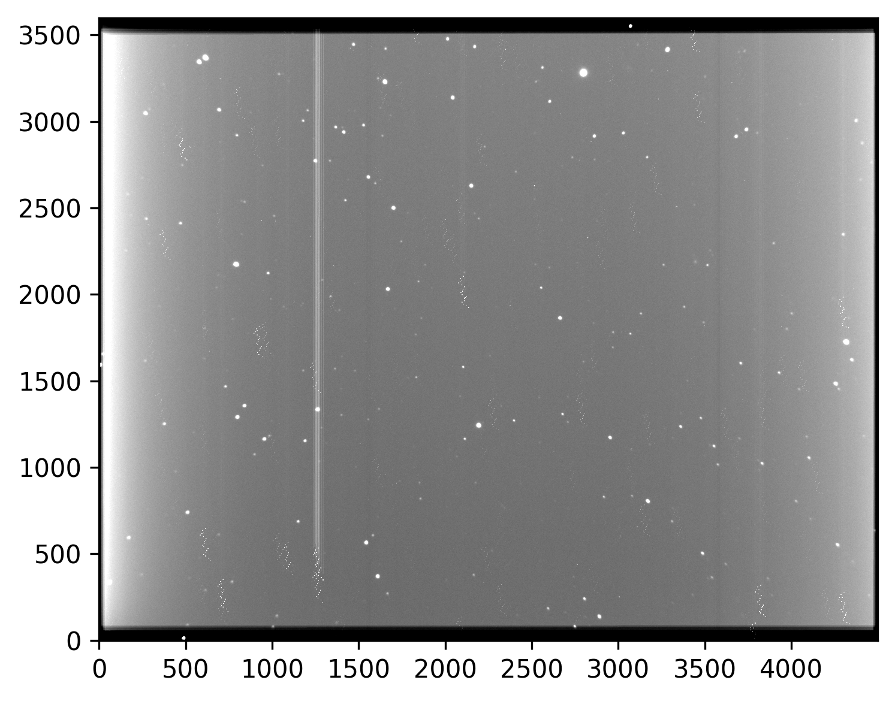

# Astronomy imagery summation tool

[](https://github.com/SeverinDenisenko/astroimsum/actions/workflows/cmake-multi-platform.yml)

## About



This tool can add images (in .fits format) with stars on them. Tool computes proper transform frame to frame, to make all sourses line up together.

## Usage

```
imsum <base-image> <images-count> <other-images>
```

This command adds other images to base image and results in out.fits.

## Dependencies

- Source extractor
- Boost
- C++17 or higher
