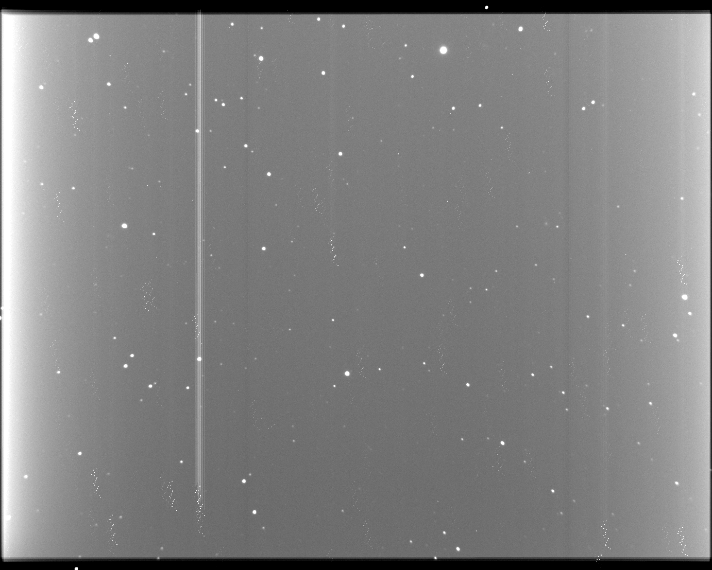

# Astronomy imagery summation tool

[](https://github.com/SeverinDenisenko/astroimsum/actions/workflows/cmake-multi-platform.yml)

## About



This tool can add images (in .fits format) with stars on them. Tool computes proper transform frame to frame, to make all sourses line up together.

## Usage

```bash
imsum <base-image> <images-count> <other-images>
```

This command adds other images to base image and results in out.fits.

## Pyhton interface

Example (jupiter notebook):

```Python
from python.astroimsum import astroimsum

frames = glob("path_to_frames/*.fits")

base_frame_index = len(frames) // 2 - 1
base_frame = frames[base_frame_index]
other_frames = frames[:base_frame_index] + frames[base_frame_index + 1 :]

lib = astroimsum.astroimsum()

!{"rm result.fits"} # Without that kernel will die!

base_frame_loaded = lib.load_frame(base_frame)
lib.set_base_frame(base_frame_loaded)

other_frames_loaded = []
for frame in other_frames:
    other_frames_loaded.append(lib.load_frame(frame))

for frame in other_frames_loaded:
    lib.add_frame(frame)

base_frame_loaded.write("result.fits")
```

## Dependencies

- Source extractor
- Boost
- C++17 or higher
